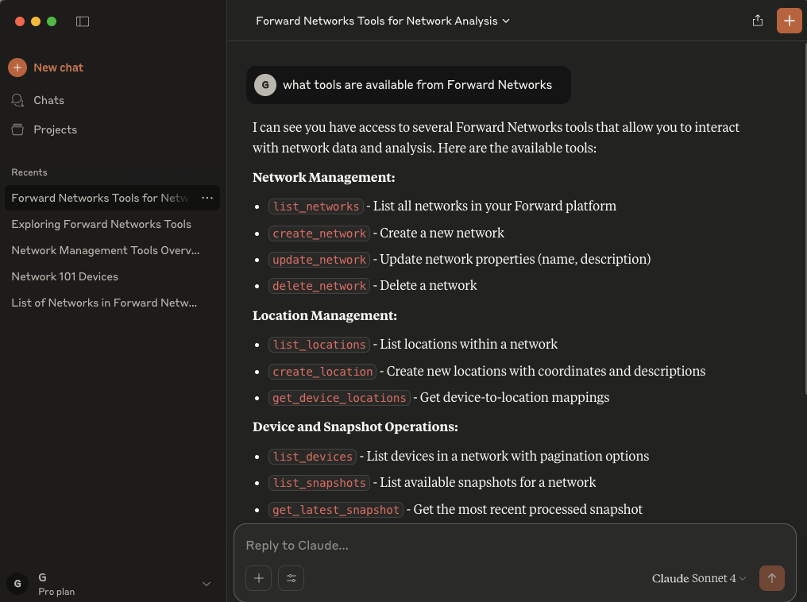

# Forward Networks MCP Server

A Model Context Protocol (MCP) server that provides access to Forward Networks API functionality through Claude Desktop and other MCP-compatible clients.

Built using [mcp-golang](https://github.com/metoro-io/mcp-golang) for type-safe, low-boilerplate MCP tool implementation.

## Features

### 🌐 Network Management
- **list_networks** - List all networks in the Forward platform
- **create_network** - Create a new network
- **delete_network** - Delete a network
- **update_network** - Update network properties

### 🔍 Path Search
- **search_paths** - Search for network paths by tracing packets through the network
  - Support for source/destination IPs, ports, protocols
  - Intent-based search (delivered, violations, violations-only)
  - Configurable result limits and timeouts

### 🔧 Network Query Engine (NQE)
- **run_nqe_query** - Execute NQE queries on network snapshots
- **list_nqe_queries** - Browse available queries from the NQE library

### 📱 Device Management
- **list_devices** - List devices in a network
- **get_device_locations** - Get device location mappings

### 📸 Snapshot Management
- **list_snapshots** - List network snapshots
- **get_latest_snapshot** - Get the latest processed snapshot

### 📍 Location Management
- **list_locations** - List network locations
- **create_location** - Create new locations with coordinates

## Installation

### Prerequisites
- Go 1.21 or later
- Forward Networks API credentials
- Claude Desktop (for MCP integration)

### Build from Source

```bash
git clone https://github.com/forwardnetworks/forward-mcp.git
cd forward-mcp
go build -o bin/forward-mcp-server cmd/server/main.go
```

## Configuration

### Environment Variables

Create a `.env` file in the project root:

```env
FORWARD_API_KEY=your-api-key
FORWARD_API_SECRET=your-api-secret
FORWARD_API_BASE_URL=https://your-forward-instance.com
```

### TLS Configuration

The Forward Networks MCP server supports comprehensive TLS configuration for different deployment scenarios:

#### Skip Certificate Verification (Development/Self-Signed Certificates)

For development environments or Forward instances with self-signed certificates:

```env
FORWARD_INSECURE_SKIP_VERIFY=true
```

**⚠️ Security Warning**: Only use this in development or controlled environments. Never use in production with untrusted networks.

#### Custom CA Certificate

For Forward instances using internal CA or custom certificate authorities:

```env
FORWARD_CA_CERT_PATH=/path/to/ca-certificate.pem
```

#### Mutual TLS Authentication

For environments requiring client certificate authentication:

```env
FORWARD_CLIENT_CERT_PATH=/path/to/client-certificate.pem
FORWARD_CLIENT_KEY_PATH=/path/to/client-private-key.pem
```

#### Complete TLS Configuration Example

```env
# Basic API Configuration
FORWARD_API_KEY=your-api-key
FORWARD_API_SECRET=your-api-secret
FORWARD_API_BASE_URL=https://forward.internal.company.com

# TLS Configuration
FORWARD_INSECURE_SKIP_VERIFY=false
FORWARD_CA_CERT_PATH=/etc/ssl/certs/company-ca.pem
FORWARD_CLIENT_CERT_PATH=/etc/ssl/certs/forward-client.pem
FORWARD_CLIENT_KEY_PATH=/etc/ssl/private/forward-client.key
FORWARD_TIMEOUT=30
```

### Common TLS Scenarios

| Scenario | Configuration | Use Case |
|----------|---------------|----------|
| **Development/Testing** | `FORWARD_INSECURE_SKIP_VERIFY=true` | Self-signed certs, local testing |
| **Internal CA** | `FORWARD_CA_CERT_PATH=/path/to/ca.pem` | Corporate/internal certificate authority |
| **Mutual TLS** | Client cert + key paths | High-security environments |
| **Public CA** | No extra config needed | Standard HTTPS with public CA |

### Claude Desktop Integration

Add the following to your Claude Desktop configuration file:

**macOS**: `~/Library/Application Support/Claude/claude_desktop_config.json`
**Windows**: `%APPDATA%/Claude/claude_desktop_config.json`

```json
{
  "mcpServers": {
    "forward-networks": {
      "command": "/path/to/forward-mcp/bin/forward-mcp-server",
      "args": [],
      "env": {
        "FORWARD_API_KEY": "your-api-key-here",
        "FORWARD_API_SECRET": "your-api-secret-here",
        "FORWARD_API_BASE_URL": "https://your-forward-instance.com"
      }
    }
  }
}
```




## Usage Examples

Once configured with Claude Desktop, you can use natural language to interact with your Forward Networks environment:

### Network Management
```
"List all networks in my Forward platform"
"Create a new network called 'Production-East'"
"Show me the details of network ID abc123"
```

### Path Analysis
```
"Search for paths from 10.1.1.1 to 10.2.2.2 in network xyz789"
"Find all violation paths for traffic to 192.168.1.100"
"Trace HTTP traffic from device router1 to 10.0.0.50"
```

### Network Queries
```
"Run an NQE query to show all BGP sessions in network abc123"
"List available NQE queries in the L3 directory"
"Show me all devices with OSPF enabled"
```

### Device and Location Management
```
"List all devices in network xyz789"
"Show device locations for network abc123"
"Create a new location called 'Data Center East' at coordinates 40.7128, -74.0060"
```

## Architecture

```
┌─────────────────┐    ┌──────────────────┐    ┌─────────────────────┐
│   Claude        │    │   Forward MCP    │    │   Forward Networks  │
│   Desktop       │◄──►│   Server         │◄──►│   API               │
│                 │    │                  │    │                     │
│   (MCP Client)  │    │   (mcp-golang)   │    │   (REST API)        │
└─────────────────┘    └──────────────────┘    └─────────────────────┘
```

### Key Components

- **MCP Server**: Built with [mcp-golang](https://github.com/metoro-io/mcp-golang) for type-safe tool definitions
- **Forward Client**: HTTP client for Forward Networks API with comprehensive endpoint coverage
- **Tool Handlers**: Type-safe functions that map MCP tool calls to Forward API operations
- **Transport**: stdio transport for full MCP compatibility with Claude Desktop

## Development

### Project Structure

```
forward-mcp/
├── cmd/server/           # Main server application
├── internal/
│   ├── config/          # Configuration management
│   ├── forward/         # Forward Networks API client
│   └── service/         # MCP service implementation
├── spec/                # API specifications
└── bin/                 # Built binaries
```

### Adding New Tools

1. Define argument struct in `internal/service/tools.go`:
```go
type MyNewToolArgs struct {
    NetworkID string `json:"network_id" jsonschema:"required,description=Network ID"`
    // ... other fields
}
```

2. Implement the tool function in `internal/service/mcp_service.go`:
```go
func (s *ForwardMCPService) myNewTool(args MyNewToolArgs) (*mcp.ToolResponse, error) {
    // Implementation
}
```

3. Register the tool in `RegisterTools()`:
```go
server.RegisterTool("my_new_tool", "Description", s.myNewTool)
```

### Testing

The Forward Networks MCP Server includes a comprehensive testing framework with unit tests, integration tests, and performance benchmarks.

### Quick Test Commands

```bash
# Run unit tests with mock client
./scripts/test.sh unit -v

# Run tests with coverage report
./scripts/test.sh unit -c

# Run performance benchmarks
./scripts/test.sh bench

# Run integration tests (requires .env with API credentials)
./scripts/test.sh integration
```

### Test Coverage

- ✅ **13/13 MCP Tools** - Complete coverage of all Forward Networks tools
- ✅ **Mock Client** - Full Forward Networks API simulation for fast, reliable tests
- ✅ **Integration Tests** - Real API validation when credentials are available
- ✅ **Error Handling** - Comprehensive error scenario testing
- ✅ **Performance Benchmarks** - ~2.4μs per tool operation
- ✅ **76.4% Code Coverage** - With detailed HTML coverage reports

For detailed testing documentation, see [TESTING.md](TESTING.md).

## Troubleshooting

### TLS Certificate Issues

If you encounter TLS certificate verification errors (common with self-signed certificates or internal CA):

```env
# Quick fix for development/testing
FORWARD_INSECURE_SKIP_VERIFY=true
```

⚠️ **Security Warning**: Only use `FORWARD_INSECURE_SKIP_VERIFY=true` in development environments.

For comprehensive troubleshooting including TLS configuration, authentication issues, and debugging tips, see [TROUBLESHOOTING.md](TROUBLESHOOTING.md).

## Contributing

1. Fork the repository
2. Create a feature branch
3. Make your changes
4. Add tests for new functionality
5. Submit a pull request

## License

MIT License - see [LICENSE](LICENSE) file for details.

## Support

For issues and questions:
- GitHub Issues: [Create an issue](https://github.com/forwardnetworks/forward-mcp/issues)
- Forward Networks Documentation: [Forward Networks Docs](https://docs.forwardnetworks.com/)
- MCP Specification: [Model Context Protocol](https://modelcontextprotocol.io/) 